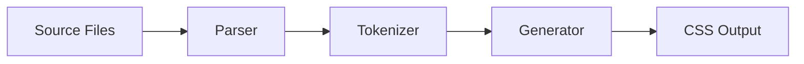

# Compiler Development

This skill covers the build-time compiler used by the CLI commands (`senangstart build` and `senangstart dev`).

## Compiler Architecture

```
src/compiler/
├── index.js          # Main compiler entry point
├── parser.js         # HTML/JSX attribute extraction
├── tokenizer.js      # Re-exports from core tokenizer
└── generators/
    ├── css.js        # Main CSS generator (~2200 lines)
    ├── preflight.js  # Base reset styles
    ├── typescript.js # TypeScript definitions
    └── ai-context.js # AI context generation
```

## Compilation Pipeline



1. **Parser** extracts `layout`, `space`, `visual` attribute values from HTML/JSX
2. **Tokenizer** parses raw strings into structured token objects
3. **Generator** transforms tokens into CSS rules

---

## Parser (`src/compiler/parser.js`)

Extracts SenangStart attributes from source files using regex.

### Key Functions

```javascript
// Parse single file content
parseSource(content) → { layout: Set, space: Set, visual: Set }

// Parse multiple files
parseMultipleSources([{path, content}]) → combined results
```

### Regex Patterns

```javascript
const ATTRIBUTE_PATTERNS = {
  layout: /layout\s*=\s*["']([^"']*)\["']/g,
  space:  /space\s*=\s*["']([^"']*)\["']/g,
  visual: /visual\s*=\s*["']([^"']*)\["']/g
};
```

### Security Features
- Value length limits (10,000 chars max)
- Token length limits (500 chars max)
- Fresh regex per parse to prevent state issues

---

## Tokenizer (`src/core/tokenizer-core.js`)

Transforms raw attribute strings into structured token objects.

### Token Structure

```javascript
{
  raw: 'tab:hover:bg:blue-500',  // Original string
  breakpoint: 'tab',             // null | mob | tab | lap | desk
  state: 'hover',                // null | hover | focus | active | ...
  property: 'bg',                // Utility name
  value: 'blue-500',             // Utility value
  isArbitrary: false,            // true if [bracketed]
  attrType: 'visual'             // layout | space | visual
}
```

### Key Functions

```javascript
// Tokenize single attribute string
tokenize(raw, attrType) → token object

// Tokenize all parsed attributes
tokenizeAll(parsed) → token array

// Parse token without validation (internal)
parseToken(raw) → token object

// Validate token structure
isValidToken(token) → boolean

// Sanitize value (remove semicolons)
sanitizeValue(value) → string
```

### Parsing Logic

1. Split by `:` separator
2. Check first part for breakpoint prefix
3. Check next part for state prefix
4. Remaining parts are property and value
5. Detect arbitrary values with `[brackets]`

---

## CSS Generator (`src/compiler/generators/css.js`)

The core generator transforms tokens into CSS rules.

### Main Functions

```javascript
// Generate complete CSS from tokens
generateCSS(tokens, config) → string

// Generate CSS variables from config
generateCSSVariables(config) → string

// Generate single rule from token
generateRule(token, config) → string

// Minify CSS output
minifyCSS(css) → string
```

### Generator Functions by Category

```javascript
// Layout utilities (display, flex, grid, position)
generateLayoutRule(token, config) → string

// Space utilities (padding, margin, gap, width, height)
generateSpaceRule(token, config) → string

// Visual utilities (colors, borders, shadows, transforms, etc.)
generateVisualRule(token, config) → string
```

### Adding a New Generator Pattern

In the appropriate function (e.g., `generateVisualRule`):

```javascript
// 1. Simple keyword mapping
if (prop === 'my-utility') {
  if (value === 'on') return 'my-property: value-on';
  if (value === 'off') return 'my-property: value-off';
}

// 2. Scale-based value
if (prop === 'my-scale-utility') {
  const v = config.theme.myScale?.[value];
  if (v) return `my-property: ${v}`;
}

// 3. Arbitrary value support
if (prop === 'my-arbitrary-utility') {
  if (token.isArbitrary) {
    return `my-property: ${sanitizeArbitraryValue(value)}`;
  }
  return `my-property: ${config.theme.myScale?.[value] || value}`;
}

// 4. Multi-property output
if (prop === 'inset') {
  const v = config.theme.spacing[value] || value;
  return `top: ${v}; right: ${v}; bottom: ${v}; left: ${v}`;
}
```

### CSS Selector Generation

Selectors use attribute selectors with proper escaping:

```javascript
// Simple: [visual~="bg:blue-500"]
// With state: [visual~="hover:bg:blue-500"]:hover
// With breakpoint: @media (min-width: 768px) { [layout~="tab:flex"] }
```

---

## Preflight Generator (`src/compiler/generators/preflight.js`)

Generates base reset styles similar to Tailwind's preflight.

```javascript
generatePreflight() → string  // Returns CSS reset
```

---

## Other Generators

### TypeScript (`typescript.js`)
Generates TypeScript declarations for IntelliSense.

### AI Context (`ai-context.js`)
Generates context files for AI assistants.

---

## Testing Generators

Unit tests in `tests/unit/compiler/generators/`:

```javascript
import { test, describe } from 'node:test';
import { generateVisualRule } from '../../../src/compiler/generators/css.js';

describe('my-utility', () => {
  test('generates correct CSS', () => {
    const token = { property: 'my-utility', value: 'on', attrType: 'visual' };
    const result = generateVisualRule(token, config);
    assert.strictEqual(result, 'my-property: value-on');
  });
});
```

Run tests:
```bash
npm run test:unit
```

---

## Common Patterns

### State-Aware Generation

```javascript
function generateRule(token, config) {
  const css = generateVisualRule(token, config);
  
  if (token.state) {
    // Wrap with pseudo-selector
    return `${selector}:${token.state} { ${css} }`;
  }
  
  return `${selector} { ${css} }`;
}
```

### Responsive Wrapping

```javascript
if (token.breakpoint) {
  const minWidth = config.theme.screens[token.breakpoint];
  return `@media (min-width: ${minWidth}) { ${rule} }`;
}
```

### Dark Mode Handling

```javascript
if (token.state === 'dark') {
  const darkSelector = getDarkModeSelector(config);
  return `${darkSelector} ${selector} { ${css} }`;
}
```
